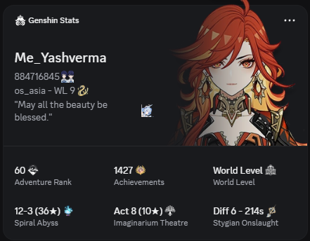
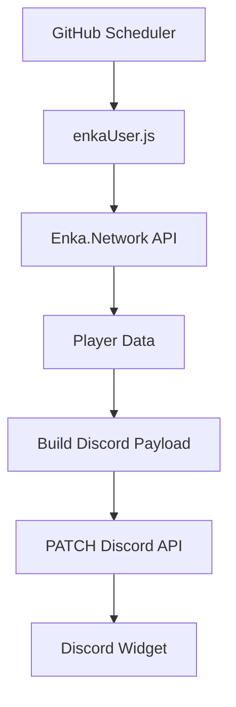

# 🎮 Discord Dynamic Genshin Profile Widget

> **Real-Time Genshin Impact Discord Widget Automation powered by
> Enka.Network & GitHub Actions**

Automatically synchronize your public **Genshin Impact** profile with
Discord's **Dynamic Profile Widget** using **Enka.Network**,
**Node.js**, and **GitHub Actions**. No VPS, database, or always-on
server required.

------------------------------------------------------------------------


------------------------------------------------------------------------

## ✨ Overview

This project fetches your public player profile from Enka.Network,
converts it into Discord's Dynamic Widget payload format, and
automatically updates your Discord profile on a schedule.

### ✅ Features

-   🎮 Adventure Rank
-   🌍 Region & World Level
-   🏆 Achievements
-   ⚔️ Spiral Abyss Progress
-   🎭 Imaginarium Theatre Progress
-   💀 Stygian Onslaught Progress
-   ✍️ Player Signature
-   ⚡ Fully automated updates via GitHub Actions

### 🏗 Infrastructure

-   GitHub Actions
-   Node.js
-   Discord Widget API
-   Enka.Network API
-   REST API Automation

> ✅ No VPS\
> ✅ No server\
> ✅ No database\
> ✅ Runs entirely on GitHub Actions

------------------------------------------------------------------------

## 📸 Preview



------------------------------------------------------------------------

## 🎮 What This Widget Displays

### Player Information

-   Nickname
-   UID
-   Region
-   Adventure Rank
-   World Level

Example:

``` txt
PLAYER      → Me_Yashverma
UID         → 884716845
REGION      → Asia
AR          → 60
WL          → 9
```

### 📊 Endgame Progress

-   Achievements
-   Spiral Abyss
-   Imaginarium Theatre
-   Stygian Onslaught

Example:

``` txt
ACHIEVEMENTS → 1427
ABYSS        → 12-3 (36★)
THEATRE      → Act 8 (10★)
STYGIAN      → Diff 6
```

------------------------------------------------------------------------

## 🏗 System Architecture



------------------------------------------------------------------------

## ⚙️ How It Works

1.  GitHub Actions triggers on schedule or manually.
2.  Node.js starts.
3.  `enkaUser.js` fetches Enka profile data.
4.  Data is transformed into a Discord widget payload.
5.  Discord API receives a PATCH request.
6.  Your widget updates automatically.

------------------------------------------------------------------------

## 🌐 APIs Used

### Enka.Network

Public profile endpoint:

``` text
https://enka.network/api/uid/{UID}?info
```

### Discord Widget API

``` http
PATCH https://discord.com/api/v9/applications/{APP_ID}/users/{USER_ID}/identities/0/profile
```

------------------------------------------------------------------------

## 📦 Example Payload

``` json
{
  "data": {
    "dynamic": [
      { "type": 1, "name": "nickname", "value": "Me_Yashverma" },
      { "type": 1, "name": "uid", "value": "UID 884716845" },
      { "type": 1, "name": "world", "value": "Asia • WL 9" },
      { "type": 2, "name": "adv", "value": 60 },
      { "type": 1, "name": "ach", "value": "1427" }
    ]
  }
}
```

------------------------------------------------------------------------

## 🤖 GitHub Actions

Workflow:

``` text
.github/workflows/update.yml
```

Schedule:

``` yaml
schedule:
  - cron: "0 */6 * * *"
```

Manual execution is also supported via **Run workflow**.

------------------------------------------------------------------------

## 📂 Project Structure

``` text
Genshin-Stats/
├── enkaUser.js
├── package.json
├── .env.example
└── .github/
    └── workflows/
        └── update.yml
```

------------------------------------------------------------------------

## 🔐 Required Secrets

    GENSHIN_UID
    DISCORD_CLIENT_ID
    DISCORD_USER_ID
    DISCORD_BOT_TOKEN

------------------------------------------------------------------------

## 🧰 Tech Stack

-   Node.js
-   GitHub Actions
-   Axios
-   Discord API
-   Enka.Network API

------------------------------------------------------------------------

## 📚 References

-   https://enka.network/
-   https://discord.com/developers/docs
-   https://docs.github.com/actions

------------------------------------------------------------------------

## ⭐ Contributing

Issues and pull requests are welcome. If you build upon this project,
please consider giving the repository a ⭐.
